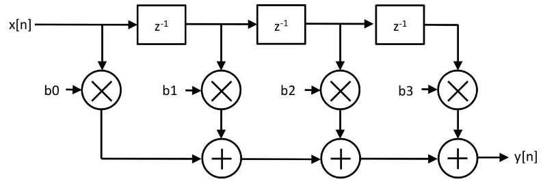
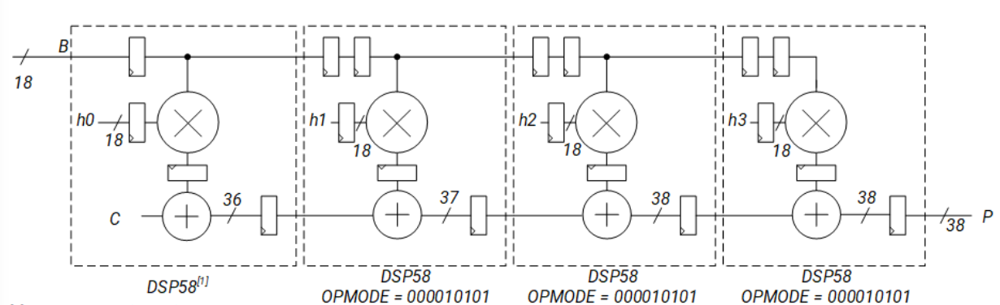
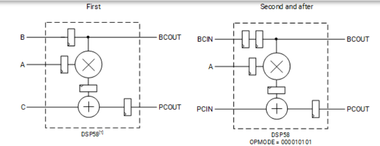
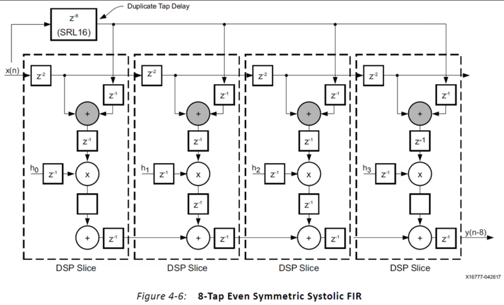

# FIR Filter Design

Design a low-pass FIR filter that allows frequencies below 400 Hz to pass through and attenuates frequencies above 400 Hz. The maximum frequency of the input signal is 1 kHz. The filter must have a passband ripple of 5 dB and a stopband attenuation of 40 dB. The filter must have a sampling frequency of 2 kHz according to the Nyquist theorem.

Use a FIR filter with 25 taps to implement the filter. The filter must be implemented in VHDL and tested using a testbench.

## Theory
An FIR filter is a digital filter whose impulse response is of finite duration. The impulse response of an FIR filter is the sequence of coefficients of the filter. The output of an FIR filter is the convolution of the input signal with the impulse response of the filter. The impulse response of an FIR filter is given by the following equation:

$ h[n] = \sum_{k=0}^{M-1} h[k] \delta[n-k] $

where:
- $ h[n] $ is the impulse response of the filter
- $ h[k] $ is the k-th coefficient of the filter
- $ \delta[n-k] $ is the unit impulse function


## Design Parameters
- Passband frequency: 400 Hz
- Stopband frequency: 500 Hz
- Sampling frequency: 2 kHz
- Passband ripple: 5 dB
- Stopband attenuation: 40 dB
- Number of taps: 25

The FIR filter coefficients were generated using this website: [FIR Filter Design](http://t-filter.engineerjs.com/). The coefficients generated as 16-bit signed integers are shown below:

```
    [621, 1252, 955, -464, -1427, -442, 1279, 815, -2028, -2978, 1849, 9985, 14052, 9985, 1849, -2978, -2028, 815, 1279, -442, -1427, -464, 955, 1252, 621]
```

## Filter design

### High level design
A high level architecture of the FIR filter is shown below:



### Systolic architecture
After further analysis, the Systolic architecture was chosen for the FIR filter implementation. The Systolic architecture is a pipelined architecture that allows the filter to process multiple samples in parallel. The architecture of the FIR filter is shown below:



#### DSP units
In this architecture, the DSP units are extensively used. (In our implementation we will use the DSP48 block available to our Vivado version). The DSP units can be used to perform complex arithmetic operations such as multiplication and addition in a single clock cycle. The DSP units are used to multiply the input samples with the filter coefficients and accumulate the results. The output of the filter is the sum of the products of the input samples and the filter coefficients. The following configuration of the DSP units were used for the FIR filter implementation:



With synthesis tools, it is possible to create DSP units in 2 ways: inference and instantiation. 
- Inference is when the synthesis tool automatically detects that a DSP unit is needed and instantiates it. This makes is easier for the designer as the synthesis tool takes care of the details but can lead to sub optimal performance.  
- Instantiation is when the designer explicitly instantiates the DSP unit in the code. This is more complex but allows the designer to have more control over the design hence allowing us to attain required performance.

### Symmetric Systolic FIR filter
When we further analyse the filter coefficients it is clear that the coefficients are symmetric. This allows us to simplify the filter implementation by using a symmetric systolic architecture. We can exploit the symmetry by only having the hardware to implement the initial half of the taps and then acquiring the values for second half by shifting the signal. To perform this we need an even number of taps, but as we have 25 taps, we will break the middle coeefficient $14052$ in half and convert it to 2 taps of $7026$. Another complexity that comes with this spliting is that, the input signal for the middle signal should not be delayed by 1 clock cycle. If this can be handled, the filter coefficients will be as follows:
    
    ```
        [621, 1252, 955, -464, -1427, -442, 1279, 815, -2028, -2978, 1849, 7026, 7026, 1849, -2978, -2028, 815, 1279, -442, -1427, -464, 955, 1252, 621]
    ```

The even symmetric systolic architecture is shown below:



## Implementation
The implementation will be based on the above architecture. The DSP blocks will be created using the inference method. The implementation can be found in the `/src` directory. A self-testing approach will be implemented to test the results of the filter. This will be done with a testbench implemented using vhdl and a octave script to generate the expected output. The testbench will be implemented in the `/test` directory.


