# Report - Analysis on for and while loop definition in Verilog

## Author
- Chathura Gunaekara (200193U)

## Introduction
In this report, we will discuss the differences between for and while loop in Verilog. This will be done by analyzing two implementations of a module using both for and while loop. The code for the two implementations is given below:

### While Loop Implementation
```verilog
module what_while(
 input [15:0] in,
 output reg [4:0] out);
 integer i;
 always @(*) begin: count
     out = 0;
     i = 15;
     while (i >= 0 && ~in[i]) begin
         out = out + 1;
         i = i - 1;
     end
  end
endmodule 
```

### For Loop Implementation
```verilog
module what_for(
 input [15:0] in,
 output reg [4:0] out
 );
 integer i;
 always @(*) begin: count
 out = 0;
     for (i = 15; i >= 0; i = i - 1) begin
         if (~in[i]) disable count;
         out = out + 1;
     end
 end
endmodule
```
Eventhough the implementations are done using loops, they are synthesized statically. This is done by **unrolling the loop and creating a combinational circuit**. The main difference between the two implementations is the way the loop is defined.

## RTL Schematic Analysis

The RTL schematic for the two implementations is shown below:

### While Loop RTL Schematic

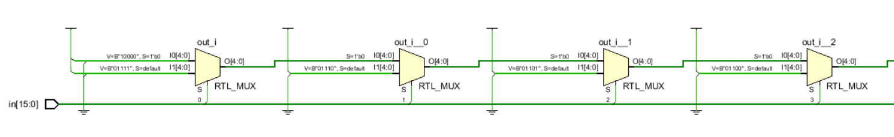
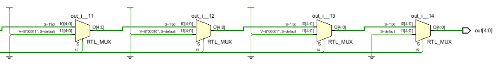

This image shows the starting and ending segments of the rtl synthesis of the while loop implementation. Here we can clearly see the loop unrolling leading to the implementation of 15 multiplexor units. The multiplexor chooses between 2 signals:
- The `0` signal corresponds to `B'10000'` (16 in decimal), which corresponds to the output for an input with all zeros. - The `1` signal in at each level corresponds to the sum upto that level. Hence, if in[10]='1' then the output will be `B'01011'` (11 in decimal).

### For Loop RTL Schematic

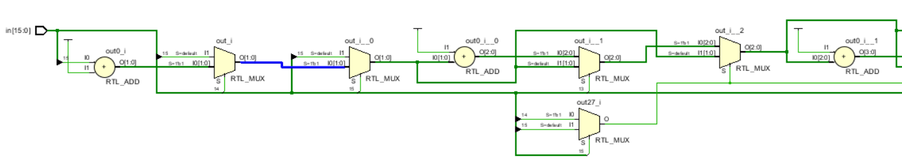
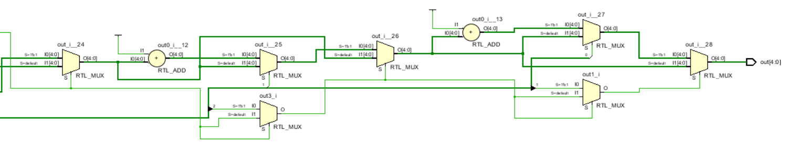
This image shows the starting and ending segments of the rtl synthesis of the for loop implementation. Unlike the while loop implementation which had a simple loop unrolling, a more complex strategy is used in the for loop implementation. The high level idea still incorperates the use of levels corresponding to the stages of the loop.
The conditional `if (~in[i]) disable count`; is implemented with MUX components that conditionally bypass the addition based on bit values. At each stage, the circuit either propagates the accumulated count forward or halts counting by passing a fixed count if a `in[i] == 1` is encountered. This is done by the combination of MUX and ADD components, structured similarly to a pipeline. The final count accumulation corresponds to the sequential adder outputs in the RTL schematic, creating a hardware-based approach to counting.

These are the major differences between the two implementations.

## Implementation Analysis

### While Loop Implementation Schematic
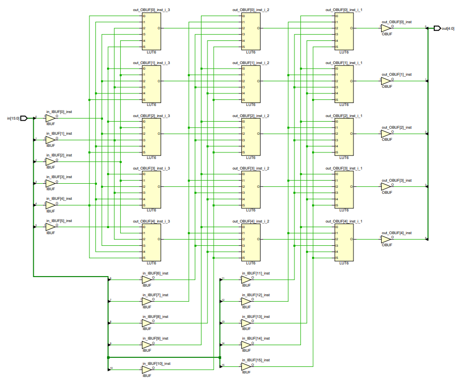
This schematic shows that the while loop implementation is constructed in RTL in a layered approach with 3 layers of 5 LUTs each.

### For Loop Implementation Schematic
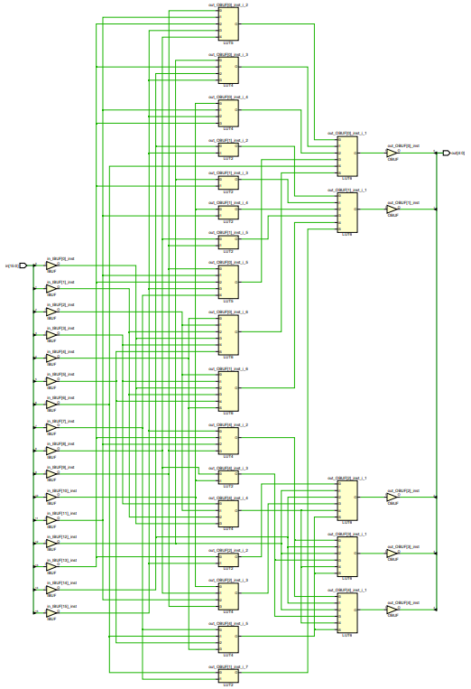

It can be observed in the code that the `disable` term is used. This is used to break out of the loop when the condition is met. This is a feature of the for loop in Verilog [[Reference](https://peterfab.com/ref/verilog/verilog_renerta/source/vrg00012.htm)]. This is not part of the Synthesizable code. (i.e. a register cannot be removed when you are not using it). 


## Timing Analysis

### Critical Path Analysis
Before the logic optimization, it is required to identify the critical paths in the design. This can be done by performing a static timing analysis. This can be done by running the synthesis tool with the timing constraints relaxed and considering the consider the __setup time__ and __hold time__. This will give a clear picture of the worst case scenario and the total delay.

For Loop Implementation 
- Setup total delay - `in[4] -> out[2] : 8.635 ns`
- Hold total delay - `in[12] -> out[3] : 2.230 ns`


While Loop Implementation: 
- Setup total delay - `in[5] -> out[1] : 9.217 ns`
- Hold total delay - `in[12] -> out[3] : 2.060 ns`

### Timing Constraints Tightening
After identifying the critical paths, the timing constraints can be tightened to improve the performance of the design. This can be done by reducing the slack in the design. This can be done by setting 2 constraints:
- Set the **maximum delay** of all inputs to the setup total delay
- Set the **minimum delay** of all inputs to the hold total delay

For Loop Implementation:

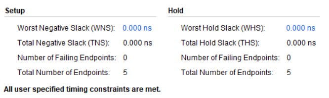

- Setup
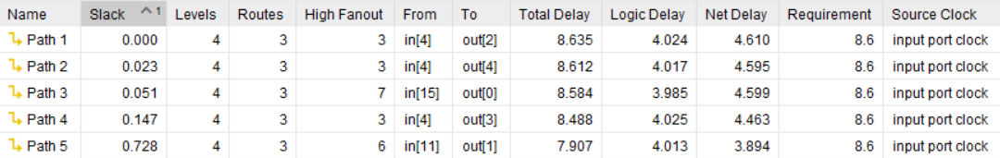

- Hold
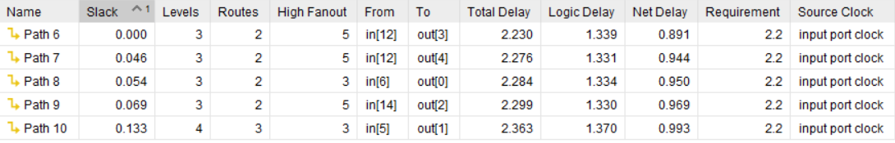

While Loop Implementation:

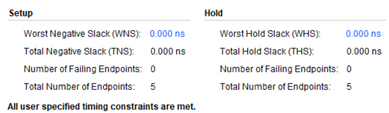

- Setup
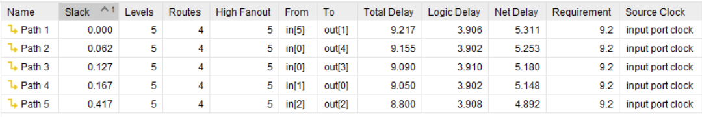

- Hold
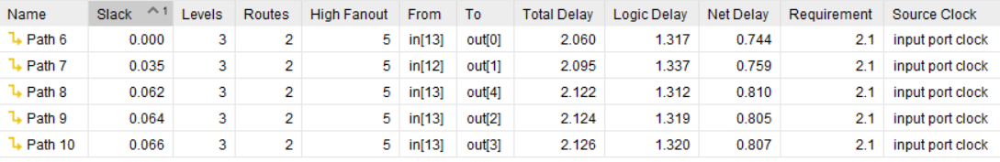

Tightening the timing constraints beyond the critical paths would result in a violation of the timing constraints as it causes **negative slack**
